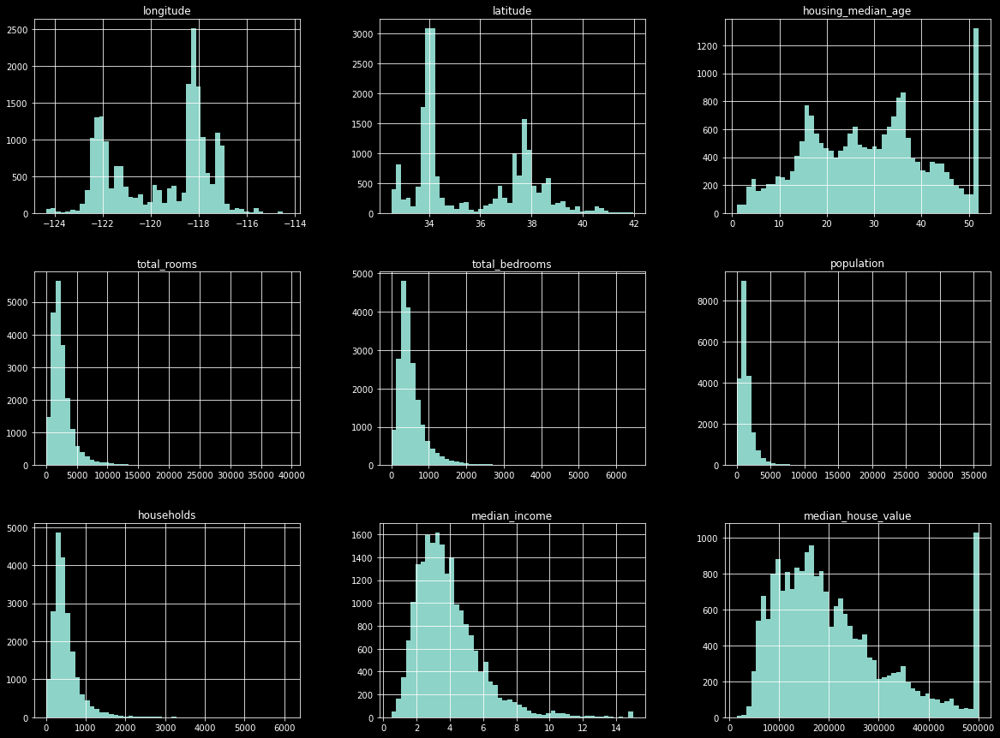
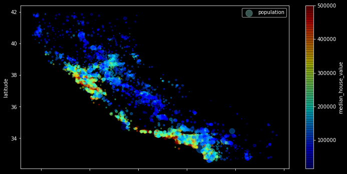
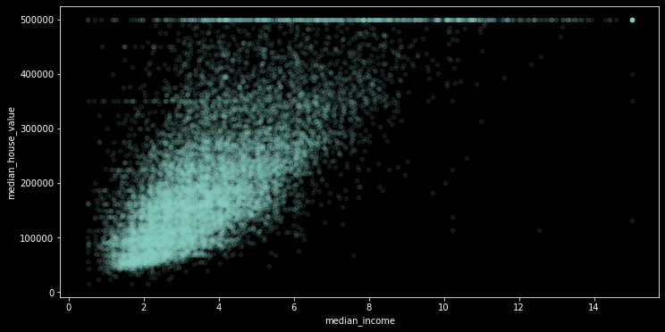

# Median House Value Estimator
Median House Value Estimation in python.

In this project I use a few regressor algorithms to estimate the median value of a house in a district.

## Getting Started
These instructions will get you a copy of the project up and running on your local machine for development and testing purposes.

### Prerequisites
* python 3.8.8

    * This setup requires that your machine has python 3.8 installed on it. you can refer to this url https://www.python.org/downloads/ to download python. Once you have python downloaded and installed, you will need to setup PATH variables (if you want to run python program directly, detail instructions are below in how to run software section). To do that check [this](https://www.pythoncentral.io/add-python-to-path-python-is-not-recognized-as-an-internal-or-external-command/).

   * Setting up PATH variable is optional as you can also run program without it and more instruction are given below on this topic.

    * Then you should run: `pip install requirements.txt`

* Second and easier option is to download anaconda and use its anaconda prompt to run the commands. To install anaconda check this url https://www.anaconda.com/download/.

## Dataset Used

### California Housing

>>#### Source

>>>This dataset is a modified version of the California Housing dataset available from [Luís Torgo's page](http://www.dcc.fc.up.pt/~ltorgo/Regression/cal_housing.html) (University of Porto). Luís Torgo obtained it from the StatLib repository (which is closed now). The dataset may also be downloaded from StatLib mirrors.

>>>This dataset appeared in a 1997 paper titled *Sparse Spatial Autoregressions* by Pace, R. Kelley and Ronald Barry, published in the *Statistics and Probability Letters* journal. They built it using the 1990 California census data. It contains one row per census block group. A block group is the smallest geographical unit for which the U.S. Census Bureau publishes sample data (a block group typically has a population of 600 to 3,000 people).

>### Tweaks
>>The dataset in this directory is almost identical to the original, with two differences:

>>* 207 values were randomly removed from the `total_bedrooms` column, so we can discuss what to do with missing data.
>>* An additional categorical attribute called `ocean_proximity` was added, indicating (very roughly) whether each block group is near the ocean, near the Bay area, inland or on an island. This allows discussing what to do with categorical data.

>#### Columns 
```
    longitude             
    latitude              
    housing_median_age    
    total_rooms           
    total_bedrooms        
    population            
    households            
    median_income         
    median_house_value    
    ocean_proximity       
```
## Creating a Test set
I created the test before before looking at the data, I am creating it at the beginning to avoid data snooping. I do not want to find what my mind thinks is interesting and use that in deciding which machine learning model to use.

* I made income categories because income is very important in estimating the housing value. I used the below code snippet.

    ```python
    housing['income_cat'] = np.ceil(housing.median_income/1.5) 
    housing.income_cat.where(housing.income_cat<5, 5, inplace=True)
    ```

* I used the income categories to randomly stratify and create representative training and test sets.
    ```python
    from sklearn.model_selection import StratifiedShuffleSplit

    split = StratifiedShuffleSplit(n_splits=1, test_size=0.2, random_state=42)
    for train_index, test_index in split.split(housing, housing.income_cat):
        train_data = housing.iloc[train_index]
        test_data = housing.iloc[test_index]
    ```
* I removed the income category from both and train and testing set.
* I saved the training and testing sets to files for easy access.

## EDA
### The below visualisations are merely highlights of exploratory analyses.
I looked at distributions and counts of the attributes.



I looked at the geographical distribution of housing value and populations. 



The median income has the most highest correlation with median house value. 



